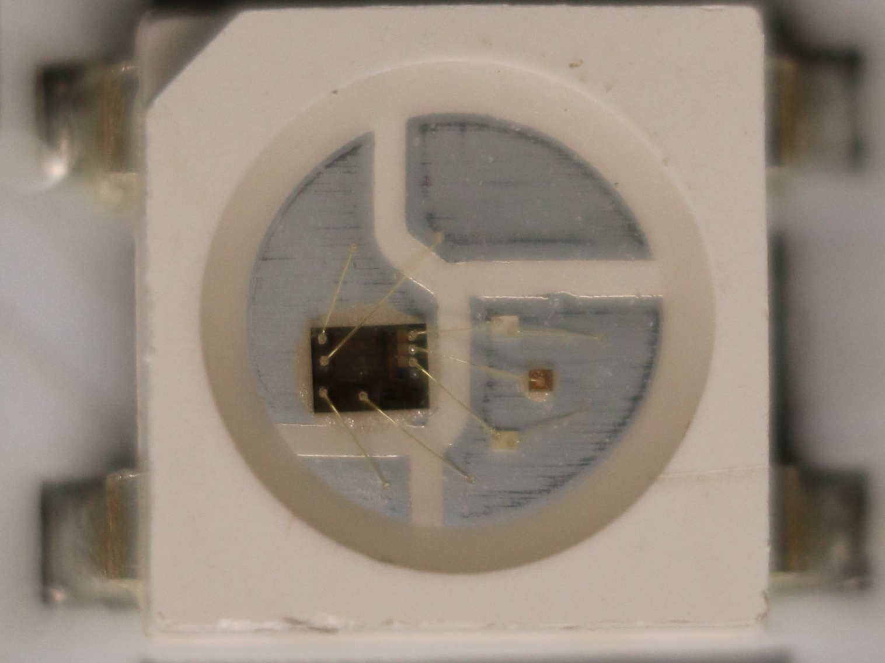
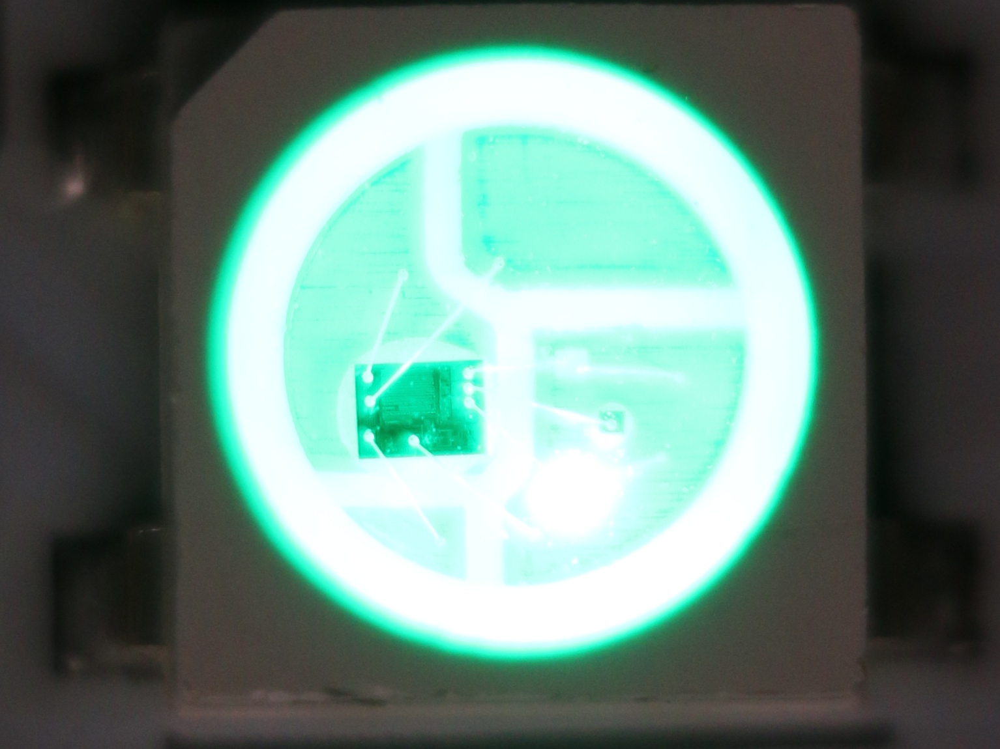
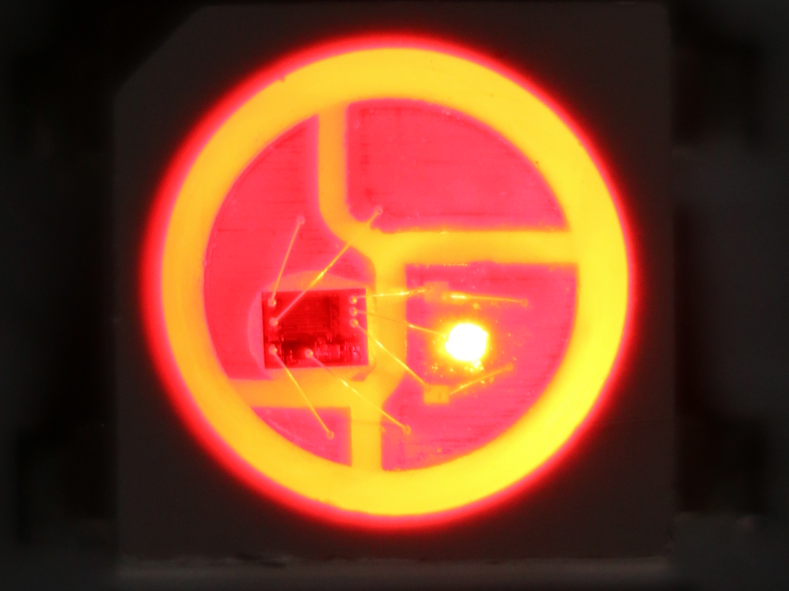
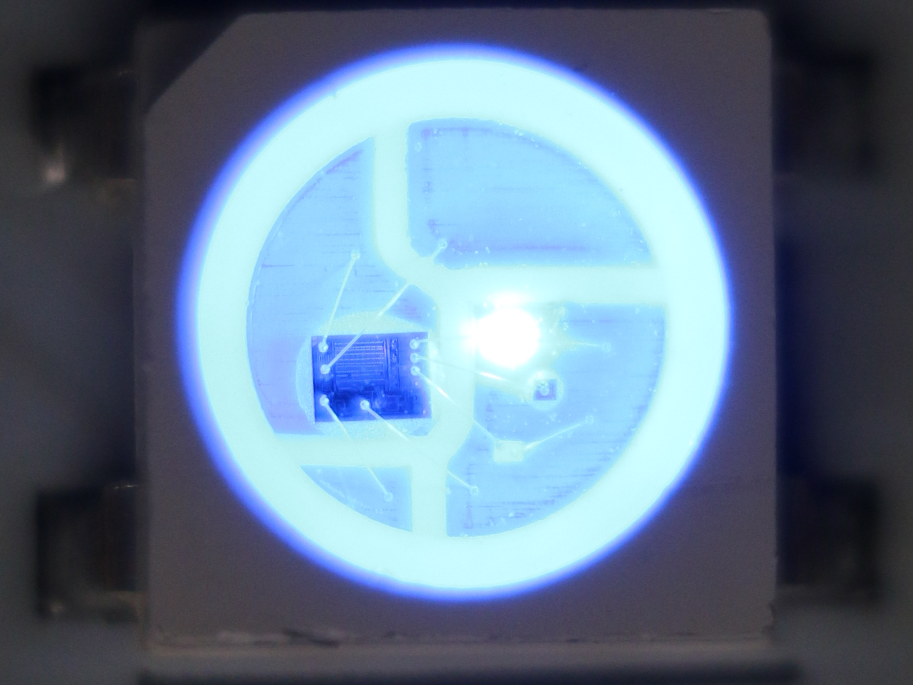
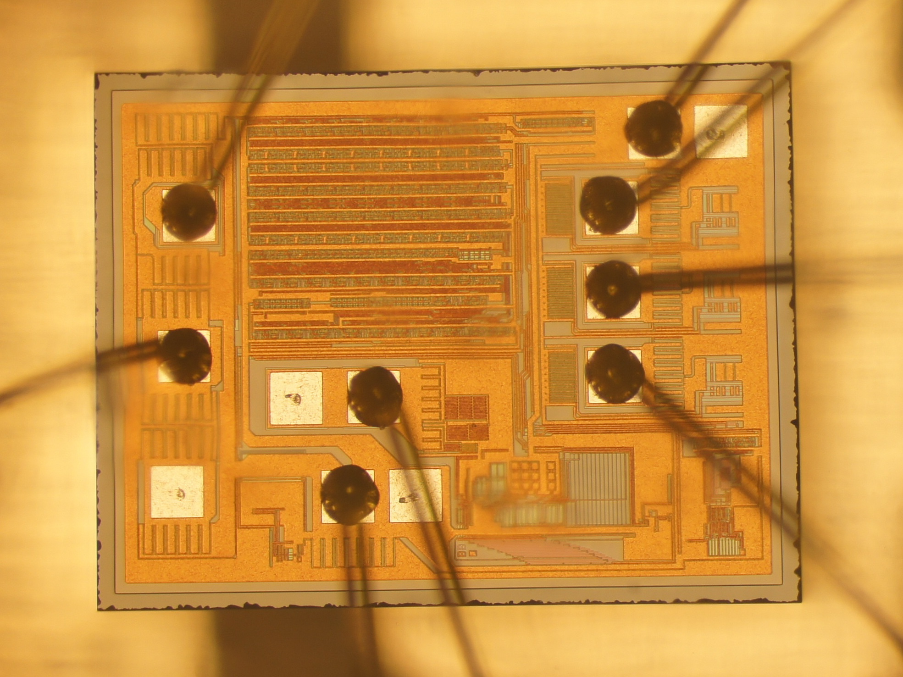
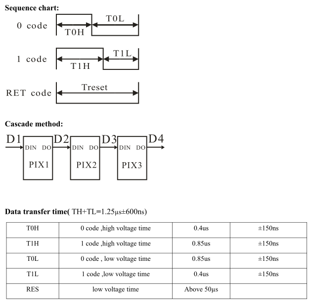
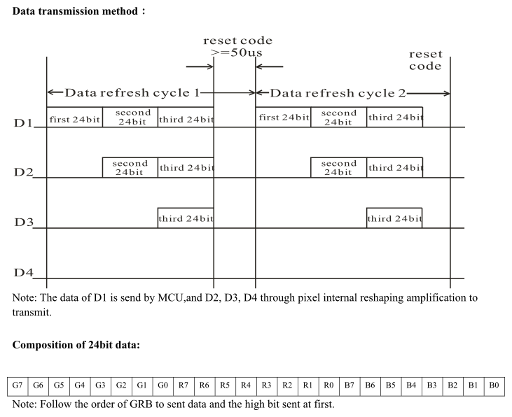
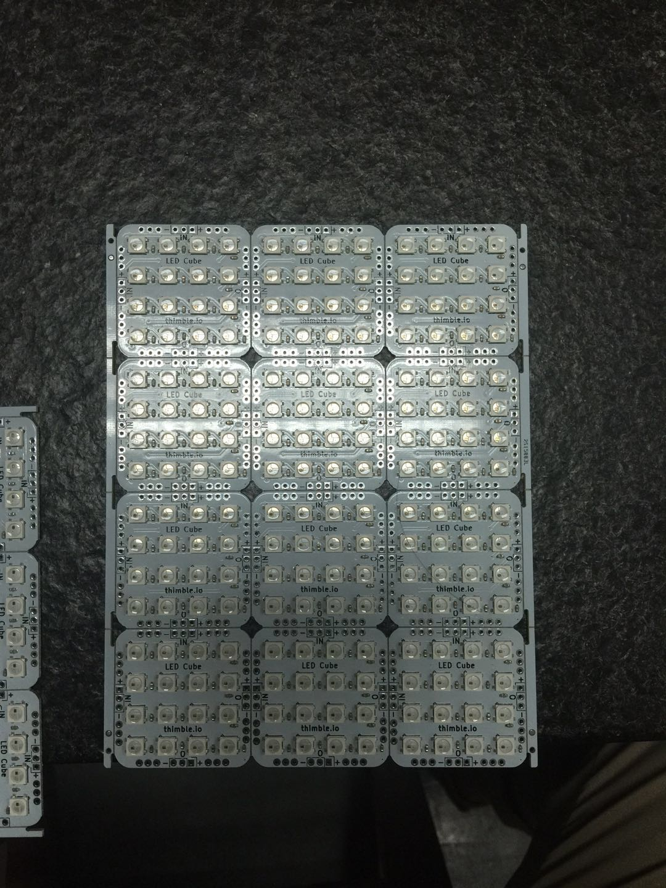

## Theory

How the cube works

As you follow through our tutorial, please know that we see this as a living document. If you discover anything unclear in the instructions, let us know and we will do our best to fix it as fast as we can. Each page of every module on our learning platform has a section for discussion at the bottom of it, so please use that to let us know about anything that is unclear. We believe strongly in the philosophy of empathy-driven development, and if something is unclear to you, it is likely unclear to others.

Our tutorials are meant to be a fun way to explore the world of electronics. We have included not only instructions, but also some theory, history, and challenges for you to explore on your own. If you only want to build the cube, you can skip over these discussions and links, but we encourage you to spend some time exploring and discussing all the resources we included here.

### WS2812B LEDs

The workhorse of this kit is the popular WS2812B, manufactured by Worldsemi. A single WS2812B "pixel" is pictured in the close up photo below (taken with a DSLR and a 10X macro lens).

Each WS2812B contains an integrated red, green, and blue LED, as well as an integrated driver circuit that allows control of the LEDs through a custom one-wire interface. They can be used individually and are also chainable, meaning you can connect the output of one LED to the input of another and create chains hundreds of LEDs long.

The photos below show the WS2812B in the 5050 package (the package size specifies the size, in this case 5mmx5mm) with the Green, Red, and Blue LEDs of the cube turned on. Each LED has 256 brightness levels, resulting in over 16 million color combinations (256x256x256=256^3=16,777,216). Click through these photos to see a close up of what happens when you turn on each of the Green, Red, and Blue diodes.

The driver IC is really the "magic" of the device and what makes it unique compared to analog RGB LEDs. The close-up photo of the WS2812 driver IC die shown above was taken by bunnie ([CC-BY-SA license](https://creativecommons.org/licenses/by-sa/4.0/)). Make sure to check out [bunnie studios](https://www.bunniestudios.com/blog/?p=2933) (his wonderful blog) for in-depth discussion of his pursuits in the world of electronics and open source hardware/software.

The printed circuit boards (PCBs) included in your kit each contain a 4x4 matrix of WS2812Bs. The individual pixels are connected within the board as shown in the diagram below.

### Controlling the WS2812B

There are a number of software libraries that handle the complexity of controlling the WS2812B device for you. Therefore, it is not necessary to understand the intricacies of the electrical interface in order to understand how to use the library, but this discussion is here for those that wish to take a deeper exploration of the device.
The following diagram, taken from the [WS2812B datasheet](assets/datasheets/WS2812B.pdf) explains how to control the WS2812B device.

The control scheme is certainly unique. It is a one-wire interface that is highly dependent on precise timing. A 24-bit data sequence is sent over the data line (8 bits for each color channel - green, red, and blue). A logical 0 and a logic 1 are both square pulses and are defined by the length of the pulse, as shown in the sequence chart below. "0 code" means logical 0 and "1 code" means logical 1. The 24 bits are sent, followed by a reset (RET code) to indicate the end of the sequence.

The second diagram below demonstrates sending data through D1 to D4, followed by the reset code. Once the reset code is received, the pixels are latched and display their true colors. ;)

A further explanation of the composition of the 24bits of data: the 3 groups of 8 bits represent the pulse width modulation (PWM) value for each of the 3 color channels - green, red, and blue. PWM is a technique that can be used to control the brightness of LEDs by varying the amount of time that power is applied to the LED. So, you can think of the PWM value to mean "brightness" of that color channel. When using PWM to control LED brightness, you are effectively turning the LED on and off at the PWM frequency. This results in a flicker. However, if the PWM frequency is fast enough, this flicker will not be detectable to the human eye, as is the case with these LEDs.

If the value of every color is set to the maximum (255), all LEDs will be set to the maximum brightness and the colors will combine so that the WS2812B will appear white to the human eye. If the value is set to 0, the LED will be off. By controlling the brightness value of each LED, we get the resulting 256^3 (16.7 million) possible color combinations.

### Manufacturing the LED Cube PCBs

Once the design is completed, These boards are manufactured by robots called [pick-and-place machines](https://en.wikipedia.org/wiki/SMT_placement_equipment). The board designs are loaded onto these machines by an operator and then the bare PCBs as well as reels of components are loaded into the machine. For the purposes of running the boards through a [surface mount technology (SMT)](https://en.wikipedia.org/wiki/Surface-mount_technology) pick-and-place machine, the individual bare printed circuit boards are arranged in a panel. A fully populated panel of Thimble LED cube PCBs is shown in the photo below.

The strips of circuit board material (FR4) along the left and right sides of the panel are called engineering or tooling edges. These edges are used to place the boards on the pick-and-place machine conveyor belt. A pick-and-place is a robotic machine that grabs electronic components (pick) and puts them in the correct position and orientation on the printed circuit board (place). The boards are then fed into a [reflow oven](https://en.wikipedia.org/wiki/Reflow_oven) where the solder within the solder paste melts (["reflows"](https://en.wikipedia.org/wiki/Reflow_soldering)), permanently connecting the joint physically and electrically.

The temperature within the reflow oven is precisely controlled as the circuit board passes through the oven. The exact temperatures and time is referred to as a thermal profile and can vary depending on the type of board, components, and solder paste used on that design. In general, the thermal profiles have a preheat zone that is meant to get the entire assembly to the same temperature, as well as to allow any solvents in the solder paste to outgas. The second phase is thermal soak, typically 60 to 120 seconds, to remove any volatiles in the solder paste and activate the flux (a chemical agent in the solder paste that helps the solder flow). The boards then enter the reflow zone which represents the maximum temperature. It is very important to precisely control the amount of time the circuit boards are in this zone, as well as the high temperature, as any deviations above the maximum temperature can cause damage to the electronic components and any deviations below can prevent the solder paste from adequately reflowing. Finally, the boards go through the cooling zone of the thermal profile to gradually cool the boards. If the boards are cooled too quickly, thermal shock to the components can result in mechanical and/or electrical damage.

The following chart, taken from Worldsemi's WS2812B usage instructions, explains the recommended SMT profile for these components.

| Curve description                                                      | SMT Line |
|------------------------------------------------------------------------|----------|
| The lowest preheat temperature (Tsmin)                                 | 150C     |
| The highest preheat temperature (Tsmax)                                | 200C     |
| Preheating time (Tsmin to Tsmax) (ts)                                  | 60-180 S |
| Average rate of temperature rise (Tsmax to Tp)                         | <3C/S    |
| Liquid phase temperature (TL)                                          | 217C     |
| Holding time liquid region (tL)                                        | 60-150 S |
| Peak temperature (Tp)                                                  | 250C     |
| High temperature region (the peak temperature -5C) residence time (tp) | <10 S    |
| Decreasing temperature rate                                            | <6C/S    |
| Stay time from room temperature to the peak temperature                | <6min    |

Once the boards are cooled, they are then tested in a pin-jig test fixture. After they pass their test, they are mechanically separated to the individual PCBs and packaged as they arrived in your kit.
